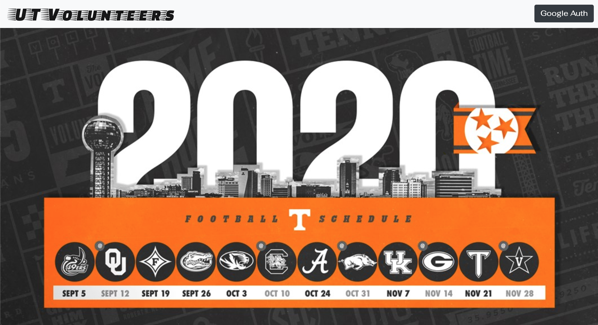
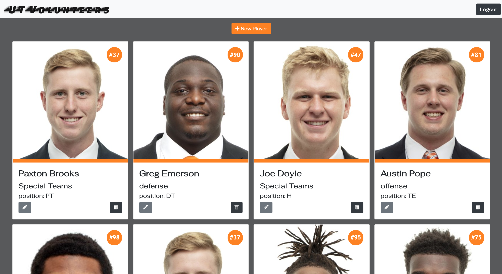
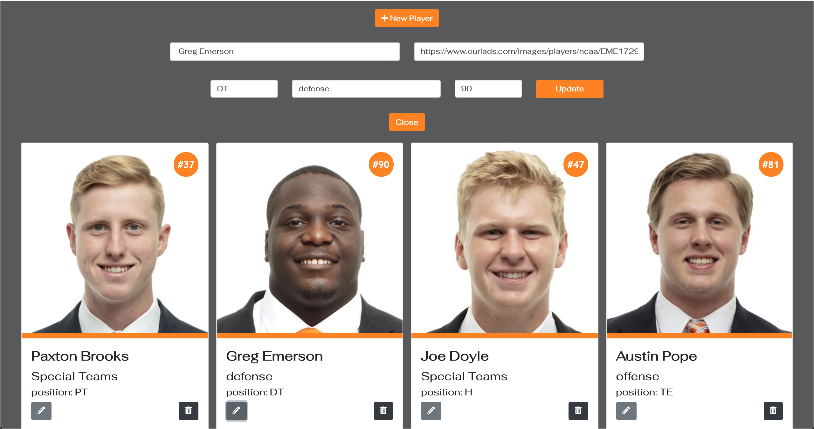

# UT Vols Football {Sports Roster}

## Description

Keeping track of your sports roster never looked so good. This project is an exercise to stretch further along into React.  This site allows users to view the current roster, update players, add new players and delete players.  Through the use of firebase and authenication only authorized users can view, edit, update and delete.

## Screenshots

**Login Screen:**

**Roster View:**

**Update Player:**

**Add Player:**

## View deployed site: https://ut-vols.web.app/

## How to Run Locally

1. Clone repo, follow instructions [here](https://help.github.com/en/github/creating-cloning-and-archiving-repositories/cloning-a-repository#about-cloning-a-repository)

2. Use npm http-server, follow instructions [here](https://www.npmjs.com/package/http-server)

3. Use the command line interface to open copied files

4. Enter Command: `npm install`

5. Enter Command: `http-server -p 3000` or `hs -p 3000`